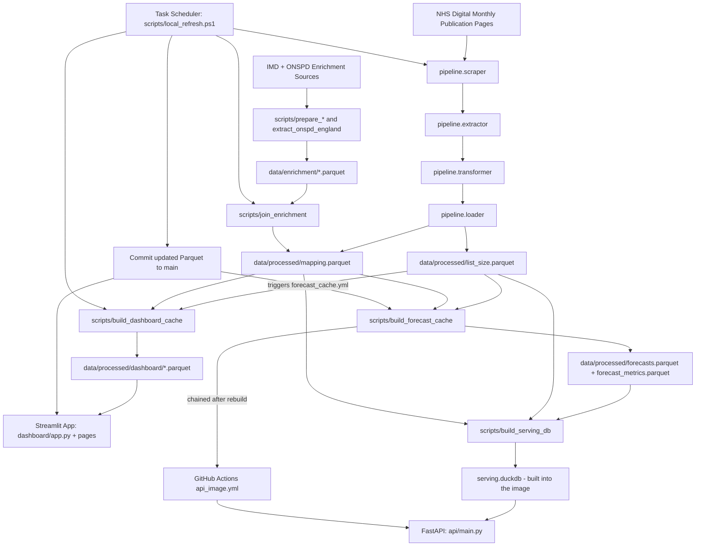

# NHS GP Analytics

An automated analytics platform built on open NHS England GP practice registration data:
a monthly ingestion pipeline, a set of science modules over the resulting time series, a
public dashboard, and a read-only REST API.

- **Dashboard** — https://nhs-gp-analytics.streamlit.app
- **API reference** — [`docs/API.md`](docs/API.md)

## What this is

A portfolio project that demonstrates end-to-end delivery — data engineering, data
science, and product design — as one running public system rather than as a notebook.

Each month, the pipeline picks up the new NHS England GP registration publication,
normalizes it, appends it to a longitudinal Parquet store, precomputes dashboard and
forecast caches, and commits the result. The dashboard and the API both serve those
committed artefacts, so nothing is fitted or aggregated at request time.

What it is built to show:

- A reproducible pipeline with the transformation logic under test
- Practical science modules — forecasting, anomaly detection, clustering, deprivation analysis — each with a written validation record
- Real production deployment, publicly reachable
- Honest documentation of the data's caveats, including source discontinuities and geography changes

## Architecture



The monthly refresh runs from a local scheduled task rather than GitHub Actions:
Cloudflare, in front of `digital.nhs.uk`, returns 403 to GitHub-hosted runners regardless
of User-Agent. Everything downstream of the scrape stays in CI, because only the scrape
needs a residential IP.

Rationale and setup are in [`docs/LOCAL_REFRESH.md`](docs/LOCAL_REFRESH.md); the operating
procedure for driving a refresh by hand is
[`docs/RUNBOOK_MONTHLY_REFRESH.md`](docs/RUNBOOK_MONTHLY_REFRESH.md).

## Quickstart

Python 3.11+ is required.

```bash
git clone https://github.com/jad-22/nhs-gp-analytics.git
cd nhs-gp-analytics
python -m venv .venv
source .venv/bin/activate        # Windows: .\.venv\Scripts\Activate.ps1
pip install -r requirements.txt -r requirements-dev.txt
```

Run the tests:

```bash
pytest -q
```

`tests/test_api.py` skips itself unless the serving dependencies are present, so add
those if you are working on the API:

```bash
pip install -r requirements-api.txt
```

## Running the pipeline

Ingest the current month's publication:

```bash
python -m pipeline.monthly
```

Ingest one specific month, or a range, with `pipeline.backfill`. `--dry-run` reports which
months are missing without downloading anything:

```bash
python -m pipeline.backfill --month january --year 2015 --dry-run
python -m pipeline.backfill --month january --year 2015
python -m pipeline.backfill --from-month january --from-year 2020 --to-month december --to-year 2025
```

Outputs:

- `data/processed/list_size.parquet` — the longitudinal registration counts
- `data/processed/mapping.parquet` — practice reference data, with enrichment joined
- `data/pipeline_log.json` — one record per run, surfaced on the dashboard

## Running the dashboard

Rebuild the cached datasets after changing processed data or science logic, then start the
app:

```bash
python scripts/build_dashboard_cache.py
python -m streamlit run dashboard/app.py     # add --server.port 8502 if 8501 is taken
```

The app serves on http://localhost:8501. Pass `--skip-anomalies` to
`build_dashboard_cache.py` for a faster rebuild while iterating; it is the slowest
cache to compute.

Entry point `dashboard/app.py`, with pages for list size trends, clinical system market
share, deprivation analysis, and about the data. Cached outputs land in
`data/processed/dashboard/`: `latest_snapshot`, `list_size_geo`, `market_share`,
`migrations`, `deprivation_latest`, `cluster_k`, `inequality`, `correlations`, and
`anomalies` (the last only when `--skip-anomalies` is *not* passed).

The science modules behind those caches live in `science/` — `forecasting.py` and
`stat_forecasting.py`, `anomaly.py`, `deprivation.py`, `clustering.py`, plus the
validation harnesses `backtesting.py` and `cluster_validation.py`. Model selection and
diagnostics are written up in [`docs/FORECAST_VALIDATION.md`](docs/FORECAST_VALIDATION.md)
and [`docs/CLUSTER_VALIDATION.md`](docs/CLUSTER_VALIDATION.md).

## Enrichment

IMD and ONSPD data are joined into `mapping.parquet`. Run in this order, then rebuild the
dashboard cache:

```bash
# 1) Stage/download prepared enrichment files
python scripts/download_enrichment.py --imd-local /path/to/imd_2025.parquet --onspd-local /path/to/onspd_postcode_lookup.parquet

# 2) Prepare IMD parquet from source CSV, if needed
python scripts/prepare_imd_parquet.py --input data/enrichment/imd_2025.csv --output data/enrichment/imd_2025.parquet

# 3) Extract England-only ONSPD parquet with DuckDB, if needed
python scripts/extract_onspd_england.py --input-glob "data/enrichment/onspd/*.csv" --output data/enrichment/onspd_postcode_lookup.parquet

# 4) Join enrichment into mapping parquet
python scripts/join_enrichment.py --mapping data/processed/mapping.parquet --imd data/enrichment/imd_2025.parquet --onspd data/enrichment/onspd_postcode_lookup.parquet
```

## Public API

The same data is served over a free, unauthenticated, read-only REST API. The core call is
a practice lookup by ODS code:

```bash
curl -s http://localhost:8000/v1/practices/A81001/forecast
```

Forecasts are **precomputed**, never fitted per request: `scripts/build_forecast_cache.py`
backtests and fits every one of the ~7,500 served series and writes
`data/processed/forecasts.parquet` and `forecast_metrics.parquet`, which are committed
like the rest of the processed data. `scripts/build_serving_db.py` then compiles those
into a `serving.duckdb` file at Docker build time, so the serving image contains no
forecasting library at all and every response is a lookup.

That rebuild runs in CI: `forecast_cache.yml` triggers on the data push the monthly refresh
produces, and the image build is chained behind it so an image never ships forecasts older
than its own history. `/v1/meta` and every forecast's `trained_through` field report the
vintage actually being served.

Run it locally:

```bash
pip install -r requirements-api.txt
python scripts/build_serving_db.py
uvicorn api.main:app --reload      # docs at /docs, spec at /v1/openapi.json
```

Full reference, caveats and worked examples: [`docs/API.md`](docs/API.md).

## Repository layout

```text
nhs-gp-analytics/
|-- .github/workflows/     # monthly_pipeline, backfill, forecast_cache, api_image
|-- api/                   # FastAPI service (routers/, docs.py, repository.py, ...)
|-- dashboard/             # Streamlit app: app.py, data.py, components/, pages/
|-- data/
|   |-- enrichment/        # IMD + ONSPD parquet
|   |-- processed/         # list_size, mapping, forecasts, forecast_metrics, dashboard/
|   |-- raw/               # git-ignored downloads
|   `-- pipeline_log.json
|-- docs/
|-- notebooks/
|-- pipeline/              # scraper, extractor, transformer, loader, monthly, backfill
|-- science/
|-- scripts/               # cache builders, enrichment prep, local_refresh.ps1
|-- tests/
|-- Caddyfile
|-- Dockerfile
|-- docker-compose.yml
|-- DESIGN.md
|-- PRODUCT.md
`-- requirements{,-dev,-api}.txt
```

## Status

The pipeline, science modules, and dashboard are complete and deployed; the monthly
refresh runs on a registered local scheduled task and the Streamlit redeploy on push is
verified.

The public API is built, tested and building in CI. What remains is hosting it: making the
GHCR package pullable, pointing a domain at the box behind Cloudflare, and verifying the
deployment end to end.

Item-level tracking and the open work are in [`docs/ROADMAP.md`](docs/ROADMAP.md).

## Documentation

| Document | What it covers |
|---|---|
| [`docs/PROJECT_SPEC.md`](docs/PROJECT_SPEC.md) | Product and engineering scope |
| [`docs/PIPELINE_IMPLEMENTATION_PLAN.md`](docs/PIPELINE_IMPLEMENTATION_PLAN.md) | How publications are detected, downloaded, transformed and committed |
| [`docs/DECISION_LOG.md`](docs/DECISION_LOG.md) | Decisions affecting data conventions and pipeline behaviour |
| [`docs/API.md`](docs/API.md) | Public API contract, caveats, worked examples |
| [`docs/LOCAL_REFRESH.md`](docs/LOCAL_REFRESH.md) | Why the refresh runs locally, and how to set the task up |
| [`docs/RUNBOOK_MONTHLY_REFRESH.md`](docs/RUNBOOK_MONTHLY_REFRESH.md) | Step-by-step procedure for running a refresh by hand |
| [`docs/FORECAST_VALIDATION.md`](docs/FORECAST_VALIDATION.md) | Forecast model selection and accuracy methodology |
| [`docs/CLUSTER_VALIDATION.md`](docs/CLUSTER_VALIDATION.md) | How the practice clustering is validated |
| [`docs/LEARNING_NOTES.md`](docs/LEARNING_NOTES.md) | Study companion to `notebooks/exploration.ipynb` |
| [`docs/ROADMAP.md`](docs/ROADMAP.md) | Delivery checklists and open work |

## Caveats

- Raw downloads under `data/raw` are git-ignored to control repository size.
- `data/processed/*.parquet`, `data/processed/dashboard/*.parquet`, and
  `data/enrichment/*.parquet` are committed, because the dashboard and the API read them
  directly.
- The source series contains discontinuities and geography changes. The About the Data
  page in the dashboard documents the ones that affect interpretation.
- Boundary GeoJSON choropleths are deferred; the dashboard uses cached practice
  latitude/longitude marker maps.
