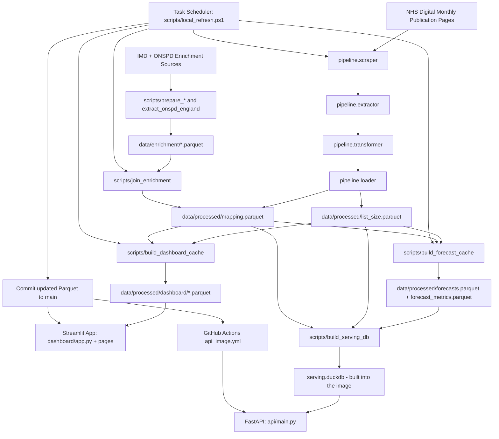

# NHS GP Analytics

Portfolio project for building an automated analytics platform on open NHS England GP practice registration data.

## Live Demo

- https://nhs-gp-analytics.streamlit.app

## Project Story

NHS GP Analytics was built to demonstrate end-to-end delivery across data engineering,
data science, and product design in one public system.

The platform ingests monthly NHS England GP registration publications, normalizes and
stores longitudinal snapshots as Parquet, precomputes dashboard-friendly analytics, and
serves a public Streamlit experience for exploration.

The project is intentionally portfolio-first:

- Clear, reproducible pipeline and transformation logic
- Practical science modules (forecasting, anomaly detection, clustering, deprivation analysis)
- Production deployment on Streamlit Cloud with public access
- Documentation of caveats such as source discontinuities and geography changes

## Architecture



The monthly refresh runs from a local scheduled task rather than GitHub Actions: Cloudflare, in
front of `digital.nhs.uk`, returns 403 to GitHub-hosted runners regardless of User-Agent. See
[docs/LOCAL_REFRESH.md](docs/LOCAL_REFRESH.md).

## Project Context

This repository follows the product and engineering scope described in:

- [docs/PROJECT_SPEC.md](docs/PROJECT_SPEC.md)
- [docs/PIPELINE_IMPLEMENTATION_PLAN.md](docs/PIPELINE_IMPLEMENTATION_PLAN.md)
- [docs/DECISION_LOG.md](docs/DECISION_LOG.md)

The objective is a production-quality monthly pipeline that ingests NHS GP registration data and powers downstream science and dashboard modules.

## Repository Layout

```text
nhs-gp-analytics/
|-- .github/workflows/
|-- api/
|   |-- routers/
|   `-- main.py
|-- data/
|   |-- enrichment/
|   |-- processed/
|   |   |-- dashboard/
|   |   |-- forecasts.parquet
|   |   |-- forecast_metrics.parquet
|   |   |-- list_size.parquet
|   |   `-- mapping.parquet
|   |-- raw/
|   `-- pipeline_log.json
|-- dashboard/
|   |-- components/
|   |-- pages/
|   |-- app.py
|   `-- data.py
|-- docs/
|-- notebooks/
|-- pipeline/
|-- science/
|-- scripts/
`-- tests/
```

## Quickstart

Python 3.11+ is recommended.

On Windows PowerShell:

```powershell
cd D:\GitHub\nhs-gp-analytics
python -m venv .venv
.\.venv\Scripts\Activate.ps1
pip install -r requirements.txt
pip install -r requirements-dev.txt
```

On macOS/Linux:

```bash
cd nhs-gp-analytics
python -m venv .venv
source .venv/bin/activate
pip install -r requirements.txt
pip install -r requirements-dev.txt
```

Run tests:

```bash
pytest -q
```

## Phase 1: Data Foundation

Phase 1 builds the processed Parquet data used by later phases.

Run a dry-run backfill target:

```bash
python -m pipeline.backfill --month january --year 2015 --dry-run
```

Run a real month backfill:

```bash
python -m pipeline.backfill --month january --year 2015
```

Run the monthly entry point scaffold:

```bash
python -m pipeline.monthly
```

Expected processed outputs:

- `data/processed/list_size.parquet`
- `data/processed/mapping.parquet`
- `data/pipeline_log.json`

## Phase 2: Data Science Modules

Phase 2 adds reusable science helpers for forecasting, anomaly detection, deprivation analysis, and clustering.

The modules live in:

- `science/forecasting.py`
- `science/anomaly.py`
- `science/deprivation.py`
- `science/clustering.py`

Validate the science layer with:

```bash
pytest tests/test_science.py -q
```

To smoke-test the modules against the local processed data, run:

```bash
python -c "import pandas as pd; from pipeline.loader import get_latest_snapshot; from science.forecasting import forecast_list_size; from science.anomaly import flag_anomalies; from science.deprivation import flag_underserved, regional_inequality, size_imd_correlation; from science.clustering import cluster_practices; latest=get_latest_snapshot(); print('latest', latest.shape, latest['SNAPSHOT_DATE'].max()); ls=pd.read_parquet('data/processed/list_size.parquet'); nat=ls.groupby('SNAPSHOT_DATE', as_index=False)['NUMBER_OF_PATIENTS'].sum(); print('forecast', forecast_list_size(nat, periods=3).shape); sample=latest.sample(min(500, len(latest)), random_state=1); print('underserved', flag_underserved(sample)['UNDER_SERVED'].sum()); print('ineq', regional_inequality(sample).shape); print('corr', size_imd_correlation(sample).shape); print('cluster', cluster_practices(sample, n_clusters=6).shape); print('anom', flag_anomalies(ls[ls['CODE'].isin(ls['CODE'].drop_duplicates().head(50))]).shape)"
```

## Phase 3: Dashboard

Phase 3 ships the Streamlit dashboard and dashboard-ready cached Parquet files.

The app entry point is:

```text
dashboard/app.py
```

Dashboard pages:

- `dashboard/pages/1_List_Size_Trends.py`
- `dashboard/pages/2_Clinical_System_Market_Share.py`
- `dashboard/pages/3_Deprivation_Analysis.py`

Cached dashboard outputs are stored under:

```text
data/processed/dashboard/
```

Rebuild the dashboard cache after changing processed data or science logic:

```bash
python scripts/build_dashboard_cache.py
```

If you only need a quicker rebuild while iterating, skip the slower anomaly cache:

```bash
python scripts/build_dashboard_cache.py --skip-anomalies
```

Expected dashboard cache files:

- `latest_snapshot.parquet`
- `list_size_geo.parquet`
- `market_share.parquet`
- `migrations.parquet`
- `anomalies.parquet`
- `deprivation_latest.parquet`
- `inequality.parquet`
- `correlations.parquet`

Start the Streamlit dashboard:

```bash
python -m streamlit run dashboard/app.py
```

Then open:

```text
http://localhost:8501
```

If port `8501` is already in use:

```bash
python -m streamlit run dashboard/app.py --server.port 8502
```

## Enrichment Run Order

Recommended order for enrichment preparation and join:

```bash
# 1) Stage/download prepared enrichment files
python scripts/download_enrichment.py --imd-local /path/to/imd_2025.parquet --onspd-local /path/to/onspd_postcode_lookup.parquet

# 2) Prepare IMD parquet from source CSV, if needed
python scripts/prepare_imd_parquet.py --input data/enrichment/imd_2025.csv --output data/enrichment/imd_2025.parquet

# 3) Extract England-only ONSPD parquet with DuckDB, if needed
python scripts/extract_onspd_england.py --input-glob "data/enrichment/onspd/*.csv" --output data/enrichment/onspd_postcode_lookup.parquet

# 4) Join enrichment into mapping parquet
python scripts/join_enrichment.py --mapping data/processed/mapping.parquet --imd data/enrichment/imd_2025.parquet --onspd data/enrichment/onspd_postcode_lookup.parquet
```

After enrichment changes, rebuild dashboard caches:

```bash
python scripts/build_dashboard_cache.py
```

## Public API

The same data is served over a free, unauthenticated, read-only REST API. The core call
is a practice lookup by ODS code:

```bash
curl -s http://localhost:8000/v1/practices/A81001/forecast
```

Forecasts are **precomputed**, never fitted per request: `scripts/build_forecast_cache.py`
backtests and fits every one of the ~7,500 served series monthly and writes
`data/processed/forecasts.parquet` and `forecast_metrics.parquet`, which are committed
like the rest of the processed data. `scripts/build_serving_db.py` then compiles those
into a `serving.duckdb` file at Docker build time, so the serving image contains no
forecasting library at all and every response is a lookup.

```bash
pip install -r requirements-api.txt
python scripts/build_serving_db.py
uvicorn api.main:app --reload      # docs at /docs, spec at /v1/openapi.json
```

Full reference, caveats and worked examples: [`docs/API.md`](docs/API.md).

## Current Status

- Phase 1 is complete: processed list-size and mapping Parquet outputs exist with enrichment joined.
- Phase 2 is complete: forecasting, anomaly detection, clustering, and deprivation helpers are implemented and tested.
- Phase 3 is complete: the Streamlit dashboard, shared components, page filters, and cached dashboard datasets are implemented and deployed on Streamlit Cloud.
- Phase 4 is in progress: monthly pipeline automation and commit-back workflow implementation is complete; live workflow/redeploy validation is next.
- Phase 5 is in progress: README story/architecture updates and an About the data dashboard page are now in place.
- Phase 6 is in progress: the forecast precompute, the FastAPI service and its container are implemented and tested locally; hosting on Hetzner behind Cloudflare is next.

## Phase 4: Pipeline Automation Checklist

- [x] Build monthly entry point (`pipeline/monthly.py`)
- [x] Implement monthly GitHub Actions workflow (`.github/workflows/monthly_pipeline.yml`)
- [x] Move the schedule to a local task after CI proved unreachable from GitHub runners (DEC-013)
- [x] Verify commit-back end to end from a clean clone (august 2026, 6,129 practices)
- [ ] Register the scheduled task on the local machine (`docs/LOCAL_REFRESH.md`)
- [ ] Backfill july 2026, missed while the CI runs were 403-blocked
- [ ] Verify Streamlit redeploy after a successful pushed run

## Notes

- Raw downloads under `data/raw` are ignored by git to control repository size.
- `data/processed/*.parquet`, `data/processed/dashboard/*.parquet`, and `data/enrichment/*.parquet` are intended to be available to the dashboard.
- Boundary GeoJSON choropleths are deferred to a later phase; Phase 3 uses cached practice latitude/longitude marker maps.
